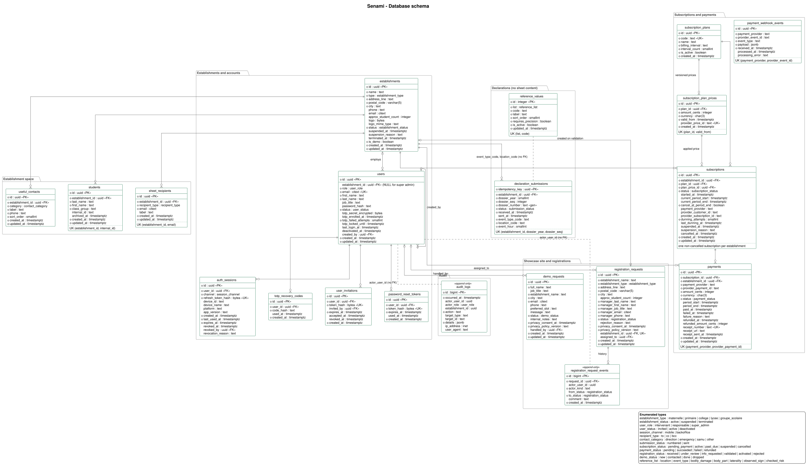

# Database

PostgreSQL 16, hosted in the EU. The schema is defined in TypeScript with
Drizzle ORM and versioned as SQL migrations.

| What                       | Where                                                                        |
| -------------------------- | ---------------------------------------------------------------------------- |
| Schema (source of truth)   | [`src/database/schema/`](../src/database/schema/)                            |
| Migrations                 | [`drizzle/`](../drizzle/)                                                    |
| Diagram                    | [`database.puml`](database.puml), rendered as [`database.svg`](database.svg) |
| Tenant transaction helpers | [`src/core/database/tenant.ts`](../src/core/database/tenant.ts)              |



## Guiding principle: no sheet is ever stored

A declaration goes through the API (numbering, PDF, email) and is then
forgotten. **No table holds the content of a sheet**: nothing about the injured
person, the signs, the care given, the photos or the PDF. The only trace is one
row of `declaration_submissions`, which carries the number, server timestamps
and three statistics fields.

Any change that would store sheet content (a new column, a job payload, a log
line) breaks a contractual commitment to the client. Do not make it.

## Tables by domain

### Establishments and accounts

| Table                   | Purpose                                                                                                                                                                                        |
| ----------------------- | ---------------------------------------------------------------------------------------------------------------------------------------------------------------------------------------------- |
| `establishments`        | The tenant. Name, address, email, phone and logo are printed on the sheet.                                                                                                                     |
| `users`                 | One table for all roles. `establishment_id` is NULL for the super admin, set otherwise (check constraint).                                                                                     |
| `user_invitations`      | Invitation links, stored as token hashes. One pending invitation per user.                                                                                                                     |
| `password_reset_tokens` | Forgotten password links, token hashes.                                                                                                                                                        |
| `auth_sessions`         | Mobile and back office sessions, revocable remotely. Refresh token stored as a SHA-256 hash, rotated on every use; the previous hash detects a replayed token. The PIN never leaves the phone. |
| `totp_recovery_codes`   | Ten single-use 2FA recovery codes, hashed.                                                                                                                                                     |

### Establishment space

| Table              | Purpose                                                                                                                  |
| ------------------ | ------------------------------------------------------------------------------------------------------------------------ |
| `sheet_recipients` | Who receives the sheet email, typed `to`, `cc` or `bcc`. At least one `to` is required to declare.                       |
| `useful_contacts`  | Direction, emergency, SAMU numbers shown in the mobile app.                                                              |
| `students`         | Last name, first name, class, optional internal id. Nothing else (ELV-02). Archived, not deleted, by a "replace" import. |

### Declarations

| Table                     | Purpose                                                                   |
| ------------------------- | ------------------------------------------------------------------------- |
| `declaration_submissions` | Registry of the numbers handed out, idempotency of retries, statistics.   |
| `reference_values`        | Form lists (location, event type, body parts...) synchronised to the app. |

### Subscriptions and payments

| Table                      | Purpose                                                                          |
| -------------------------- | -------------------------------------------------------------------------------- |
| `subscription_plans`       | A plan is a duration: `billing_interval` x `interval_count` (3 x month).         |
| `subscription_plan_prices` | Versioned prices. A price change is a new row with a later `valid_from`.         |
| `subscriptions`            | One non-cancelled subscription per establishment, pointing at the price applied. |
| `payments`                 | Payment history and receipts. No card data, ever.                                |
| `payment_webhook_events`   | Provider notifications, unique per provider event id so each is processed once.  |

### Showcase site and registrations

| Table                         | Purpose                                                                          |
| ----------------------------- | -------------------------------------------------------------------------------- |
| `registration_requests`       | Registration form, then the review workflow (received to activated or rejected). |
| `registration_request_events` | Status history of a request. Append-only.                                        |
| `demo_requests`               | Demo form and its follow-up status.                                              |

### Audit

| Table        | Purpose                                                                       |
| ------------ | ----------------------------------------------------------------------------- |
| `audit_logs` | Administration actions (invitations, revocations, 2FA reset...). Append-only. |

## What lives in the database, what lives in the code

**Business rules live in the code**, where they are unit tested with the
fake repositories: for instance "may this establishment declare" (MOB-07,
RG-03: establishment active, subscription `active` or `past_due`, at least one
`to` recipient) or "price in force for a plan". No view, no stored function
carries business logic.

**The database only holds guarantees that must hold even when the code is
wrong**: constraints, foreign keys, uniqueness, row level security, and the
append-only trigger of the two history tables.

## Mechanisms

### Tenant isolation

Every establishment-owned row carries `establishment_id`. On top of the
filters in the repositories, **row level security** (RLS) is forced on
`students`, `useful_contacts`, `sheet_recipients`, `declaration_submissions`
and `payments`: PostgreSQL itself adds the establishment filter to every query
on these tables, so a repository that forgets it still reads nothing from
another establishment. Outside a tenant transaction they read as empty and
reject writes.

The `tenant_isolation` policy is declared in the Drizzle schema
([`schema/policies.ts`](../src/database/schema/policies.ts)); only the
`FORCE ROW LEVEL SECURITY` statements, which drizzle-kit cannot express, are in
a hand-written migration.

```ts
// Establishment users
await withTenant(db, establishmentId, (tx) => tx.select().from(students));

// Super administrator and system jobs only
await asSuperAdmin(db, (tx) => tx.select().from(payments));
```

The application connects as `senami_app`, which owns the tables but is not a
superuser: a superuser bypasses RLS, even forced, and would hide every
isolation bug. `test/tenant-isolation.e2e-spec.ts` covers the behaviour.

### Dossier numbering (RG-01)

Format `AAAA-NNNNNNN`: year of **reception** (Europe/Paris) and rank within the
year for the establishment. The counter restarts on January 1st by itself,
since the rank is computed per year. Allocation, in one transaction:

```sql
SELECT 1 FROM establishments WHERE id = $1 FOR NO KEY UPDATE; -- serialises one establishment
INSERT INTO declaration_submissions (idempotency_key, establishment_id, dossier_year, dossier_seq, ...)
SELECT $2, $1, $3, coalesce(max(dossier_seq), 0) + 1
FROM declaration_submissions WHERE establishment_id = $1 AND dossier_year = $3
ON CONFLICT (idempotency_key) DO NOTHING;
```

`FOR NO KEY UPDATE` rather than `FOR UPDATE`, so inserts referencing the
establishment elsewhere are not blocked. The unique constraint on
`(establishment_id, dossier_year, dossier_seq)` is the last line of defence.
**The table is never purged**: deleting rows would issue numbers again.

### Idempotent sending (HL-06)

The phone generates `idempotency_key` when the declaration is created.

| State on arrival     | Behaviour                                                                   |
| -------------------- | --------------------------------------------------------------------------- |
| Unknown key          | Allocate a number (`numbered`), build the PDF, send the email, mark `sent`. |
| Key already `sent`   | Return the existing number. No second email.                                |
| Key still `numbered` | A previous attempt failed after numbering: reuse the number, send again.    |

The whole flow runs in memory, in the request. Never put it in a job queue: a
queue stored in PostgreSQL would store the sheet.

### Reference lists and free text

`location`, `event_type` and `bodily_damage` accept a value outside their
list: their `autre` entry has `requires_precision`, and the app then asks for
free text. **That text goes on the PDF only and is never stored on the
server**: it can name a child. The registry keeps the code `autre`.

### Statistics

No statistics table. `declaration_submissions` carries `event_type_code`,
`location_code` and `event_hour` (0-23, never the date of the event); the
month comes from `received_at`. Statistics are `GROUP BY` queries; hour
slots are grouped at display time. Exclude establishments with `is_demo`.

### Timestamps and history

- `updated_at` is set by Drizzle (`$onUpdate`) on every update query. A raw
  SQL update must set it itself.
- `registration_request_events` and `audit_logs` reject `UPDATE` and `DELETE`
  (trigger `forbid_mutation`, the only function in the database). They have
  no foreign key to `users`, so the history outlives a deleted account.
  `test/database-guarantees.e2e-spec.ts` covers both.
- Timestamps are `timestamptz`, stored in UTC, displayed in Europe/Paris.
- Emails are `citext`: unique regardless of case.

### Enums

Every PostgreSQL enum is built from a TypeScript enum of
`src/shared/enums/` (`pgEnum('user_role', UserRole)`): the values exist in
one place, and the column types follow. Two text columns with a fixed set of
values are typed the same way and checked from their enum: `auth_sessions.platform`
(`DevicePlatform`) and `registration_request_events.actor_kind`
(`RegistrationActorKind`). Adding a value is a schema change: edit the enum,
then `pnpm db:generate`.

## Seeding

Seeders create what is missing and never change what exists: they can run
again safely ([spec](features/database/seeders.md)).

| Level       | Creates                                                                                                                         | Where               |
| ----------- | ------------------------------------------------------------------------------------------------------------------------------- | ------------------- |
| `bootstrap` | the first super administrator                                                                                                   | every environment   |
| `demo`      | yearly plan, demo establishment (`is_demo`), its subscription, a responsable, an intervenant, a `to` recipient, useful contacts | never in production |

```bash
pnpm db:seed              # all, from the sources (development)
pnpm db:seed:bootstrap
pnpm db:seed:demo
# any other environment, after the migrations, with the API image:
docker run --rm -e DATABASE_URL=... -e SEED_SUPER_ADMIN_EMAIL=... \
  -e SEED_SUPER_ADMIN_PASSWORD=... senami-api node dist/database/seeds/seed.js bootstrap
```

Passwords come from `SEED_SUPER_ADMIN_PASSWORD` and `SEED_DEMO_PASSWORD`
(12 characters at least), never from the code, and never reach the logs.
A new seeder implements `Seeder` in `src/database/seeds/seeders/` and is
listed in `seedersFor()`.

## Changing the schema

1. Edit the tables in `src/database/schema/`. Keys are camelCase, columns come
   out snake_case (`casing: 'snake_case'`, set both in `drizzle.config.ts` and
   in `DatabaseModule`).
2. `pnpm db:generate --name=<what_changed>` and **read the generated SQL**.
3. Only what drizzle-kit cannot express (triggers, `FORCE ROW LEVEL SECURITY`,
   data) goes in a hand-written migration:
   `pnpm exec drizzle-kit generate --custom --name=<what_changed>`. drizzle-kit
   does not track these files: review them as carefully as code. Do not add
   views or functions that carry business logic: it belongs in the services.
   A new establishment-owned table gets `tenantIsolation()` in its schema and
   a `FORCE ROW LEVEL SECURITY` line in a migration.
4. `pnpm db:migrate`, then `pnpm test:e2e` (it migrates the test database).
5. Update this file and `database.puml` (render it with
   `docker run --rm -v "$PWD":/data -w /data plantuml/plantuml -tsvg database.puml`
   from `docs/`).

Never edit a migration that has been applied anywhere other than your own
machine: write a new one.

## Open questions

Decisions pending with the client, which may change the schema:

- `reference_values` and the statistics fields are still under review.
- Whether `declaration_submissions` (a permanent registry, without sheet
  content) is acceptable against the "no sheet table" commitment.
- Price change policy for running subscriptions (keep the old price or move
  to the new one at renewal).
- Whether a validated registration starts as `pending_payment` or with a trial.
- Whether the establishment email is mandatory.
